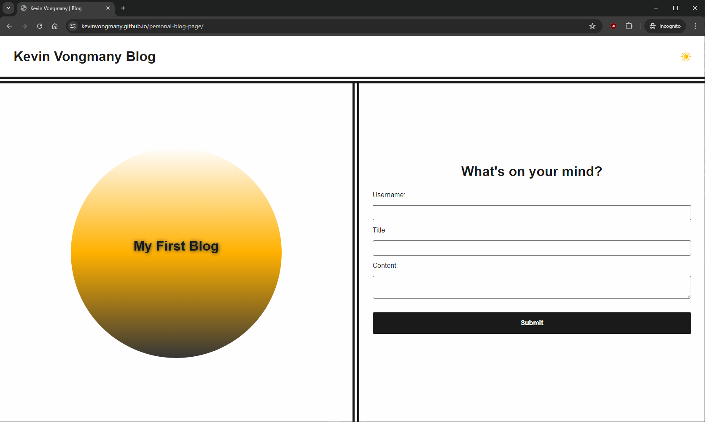
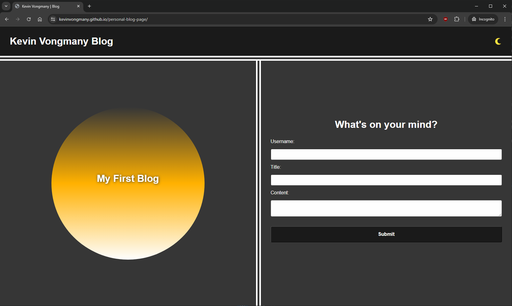
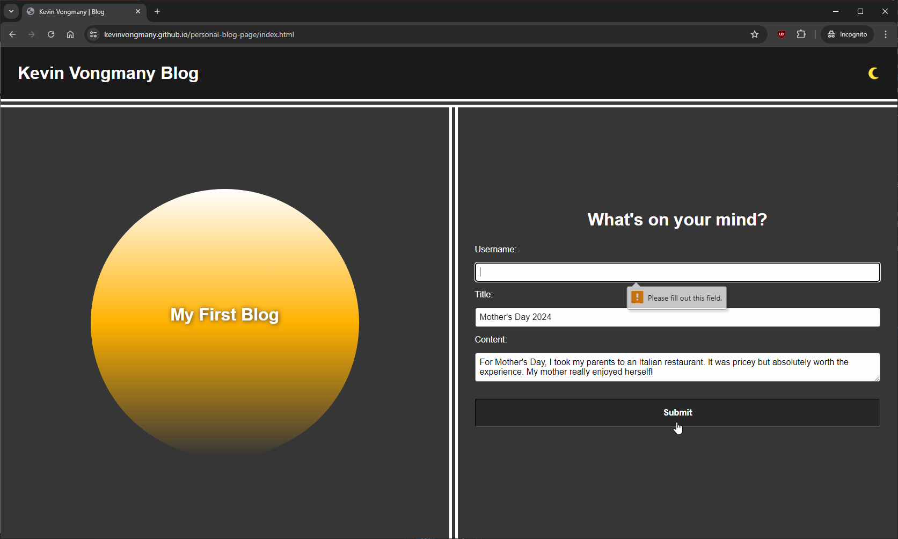
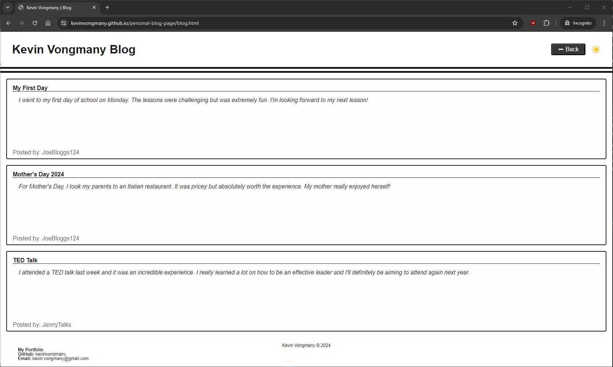
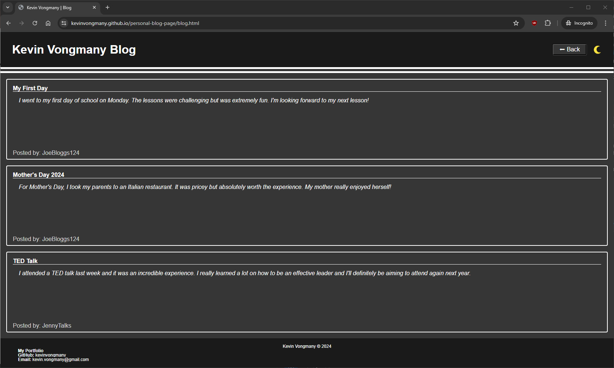
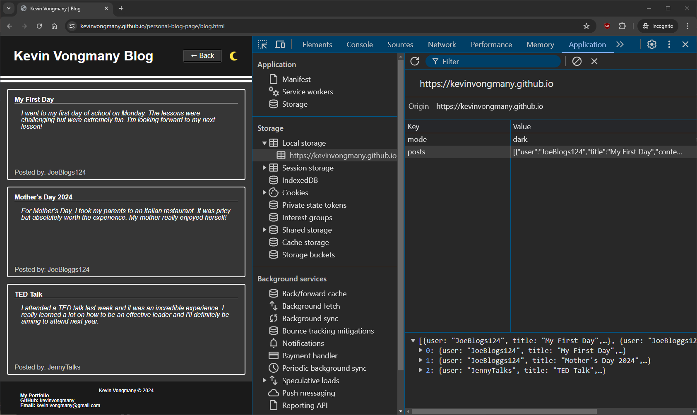
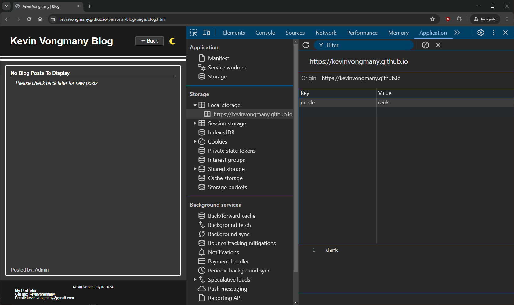

# Personal Blog

This repository contains the code for a personal blog website. The website allows users to input and view blog posts, and includes features such as a content form, dynamically rendered blog posts, and a light/dark mode toggle. The project is built using JavaScript and utilizes the Document Object Model (DOM) for manipulating the webpage. 

## Features

From the landing page, users can toggle dark mode by clicking on the sun/moon icon on the top-right corner and navigate to the blog posts page by clicking on the Circle in the landing page, or by submitting the provided blog entry form.

The blog entry form takes 3 inputs:
- Username
- Title
- Blog content

The user will be alerted to fill out all 3 fields before it will submit the data. Upon submission, the user data will be stored into an localStorage object.

The blog page will render the data from the localStorage object into the DOM using JavaScript.


## Deploy

This repository contains the source code for the webpage, written in HTML, CSS and JavaScript. The final rendered webpage can be located at https://kevinvongmany.github.io/personal-blog-page/. 

Additionally users can access the source code in the final webpage by pressing `F12`, `CTRL+SHIFT+I` (Windows) or `CMD+SHIFT+I` (MacOS) on any Chrome/Firefox browsers (or any Chromium driven browser). Alternatively modern web browsers can access the source code through the context menu (`right-click`) -> `View page source`.

## Samples
Samples of the webpage can be found here:

### Landing Page




### Blog Page



### Local Storage



## User Story

```md
AS A marketing student,
I WANT a personal blog
SO THAT I can showcase my thoughts and experiences.
```

## Acceptance Criteria

```md
GIVEN a personal blog
WHEN I load the app,
THEN I am presented with the landing page containing a form with labels and inputs for username, blog title, and blog content.
WHEN I submit the form,
THEN blog post data is stored to localStorage.
WHEN the form submits,
THEN I am redirected to the posts page.
WHEN I enter try to submit a form without a username, title, or content,
THEN I am presented with a message that prompts me to complete the form.
WHEN I view the posts page,
THEN I am presented with a header, with a light mode/dark mode toggle, and a "Back" button.
WHEN I click the light mode/dark mode toggle,
THEN the page content's styles update to reflect the selection.
WHEN I click the "Back" button,
THEN I am redirected back to the landing page where I can input more blog entries.
WHEN I view the main content,
THEN I am presented with a list of blog posts that are pulled from localStorage.
WHEN I view localStorage,
THEN I am presented with a JSON array of blog post objects, each including the post author's username, title of the post, and post's content.
WHEN I take a closer look at a single blog entry in the list,
THEN I can see the title, the content, and the author of the post.
WHEN I view the footer,
THEN I am presented with a link to the developer's portfolio.
```

